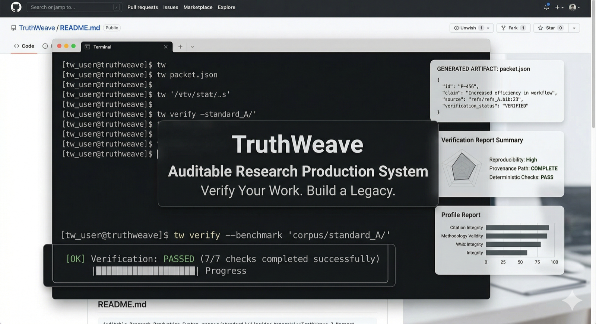

# TruthWeave

[](https://github.com/SHayashida/TruthWeave/actions/workflows/ci.yml)
[](https://www.python.org/downloads/)
[](LICENSE)
[](https://github.com/psf/black)

**Auditable research production system for papers that need traceable claims, admissible sources, and executable verification.**

TruthWeave turns a paper repository into an audit spine: research intent in `brief.yml`, source admissibility in `data_sources.yml`, claim bindings in `evidence.yml`, reviewer-facing packets, and deterministic verification outputs. It is built for teams that want a paper workflow they can inspect, rerun, and hand off without losing the evidence trail.

[`Watch showcase clip`](docs/assets/truthweave-showcase.mp4) · [`Start here`](#start-here) · [`Finance exemplar`](papers/finance_exemplar/) · [`Formal methods exemplar`](papers/formal_methods_exemplar/) · [`Resume guide`](docs/TRUTHWEAVE_RESUME_GUIDE.md)

<p align="center">
  <a href="docs/assets/truthweave-showcase.mp4">
    
  </a>
</p>
<p align="center">
  <sub>Showcase concept preview. Click the image to open the short clip.</sub>
</p>
<p align="center">
  <sub>Audit spine • provenance gate • reviewer packet • verification harness • domain profiles</sub>
</p>

[日本語版 README はこちら](README.ja.md)

## What TruthWeave Is

TruthWeave is **not** a one-prompt autonomous paper generator. It is a system for producing research artifacts under explicit contracts: what was claimed, which sources were admissible, how evidence was bound, what reviewers should inspect, and how major claims can be replayed.

## Why TruthWeave Exists

Many AI paper workflows optimize for autonomy. TruthWeave optimizes for **admissibility and verification, not maximum autonomy**. It is designed to keep traceable claims, source provenance, deterministic checks, reviewer-facing packets, executable verification paths, and domain-specific policy enforcement inside the repository rather than in undocumented process.

## Canonical Workflow

```text
brief -> refs -> provenance -> claims -> review -> packet -> verification -> build
```

This workflow keeps the paper, its evidence, and its rerun path aligned instead of relying on prose-only handoffs.

## Start Here

These are the fastest ways to understand the product from the repository itself:

- **Benchmark / failure corpus**: [`benchmarks/cases/`](benchmarks/cases/) and [`artifacts/benchmarks/benchmark_report.md`](artifacts/benchmarks/benchmark_report.md) show positive cases, negative cases, and blocked shortcuts as executable contract tests.
- **Finance exemplar**: [`papers/finance_exemplar/`](papers/finance_exemplar/) plus its [`packet.md`](artifacts/packets/finance_exemplar/packet.md) and [`verification_report.md`](artifacts/verification/finance_exemplar/verification_report.md) show a finance ML workflow with explicit temporal protocol and admissibility rules.
- **Formal methods exemplar**: [`papers/formal_methods_exemplar/`](papers/formal_methods_exemplar/) plus its [`packet.md`](artifacts/packets/formal_methods_exemplar/packet.md) and [`verification_report.md`](artifacts/verification/formal_methods_exemplar/verification_report.md) show proof-bundle declarations and exact/file-presence verification.
- **Resume / development guide**: [`docs/TRUTHWEAVE_RESUME_GUIDE.md`](docs/TRUTHWEAVE_RESUME_GUIDE.md) is the canonical restart and handoff guide for contributors and coding agents.

If you want to run one thing first, start with `uv run truthweave benchmark-contracts --format md` or `make exemplars`.

## Built-in Profiles

TruthWeave ships with `finance_ml`, `formal_methods`, and `simulation_abm`. These profiles enforce domain-specific admissibility rules, forbidden substitutes, required declarations, evaluation requirements, and verification expectations so the same workflow can carry different research contracts honestly.

## What Proves This Works

This repository already includes concrete proof assets rather than a proposal-only skeleton:

- A deterministic benchmark corpus with positive and negative contract cases under [`benchmarks/cases/`](benchmarks/cases/).
- Reviewer packet export under [`artifacts/packets/`](artifacts/packets/) for inspection and handoff.
- A verification harness under [`artifacts/verification/`](artifacts/verification/) with replay targets and reports.
- Canonical exemplar papers under [`papers/finance_exemplar/`](papers/finance_exemplar/) and [`papers/formal_methods_exemplar/`](papers/formal_methods_exemplar/).
- Profile reports under [`artifacts/profiles/`](artifacts/profiles/) showing domain-policy enforcement in practice.

## Who This Is For

TruthWeave is for researchers, labs, and engineering-heavy paper workflows that care about reproducibility, auditable claims, domain-valid evidence, and handoff-ready research contracts. It is not primarily for users who want one-prompt autonomous paper generation without provenance, policy checks, or verification.

## Quickstart

The full quickstart below walks the generic paper path end to end using `example`; the faster product-level entry points are the benchmark corpus and the two exemplars.

```bash
uv sync
uv run truthweave validate-brief --paper example
uv run truthweave validate-profile --paper example
uv run truthweave validate-provenance --paper example
uv run truthweave run exp=example
uv run truthweave discover
uv run truthweave build-paper-assets --paper example
uv run truthweave sync-refs --paper example
uv run truthweave validate-evidence --paper example
uv run truthweave provenance-report --paper example --format md
uv run truthweave claim-report --paper example --format md
uv run truthweave review-thread --paper example --phase draft_reviewed --format md
uv run truthweave reviewer-packet --paper example --format md
uv run truthweave verify-paper --paper example --format md
uv run truthweave profile-report --paper example --format md
uv run truthweave check --paper example
uv run truthweave benchmark-contracts --format md
```

## Repository Layout

TruthWeave keeps the research contract, generated assets, and verification outputs in one repository-native layout:

```text
brief.yml / references.yml / data_sources.yml / evidence.yml
  -> runs/ + artifacts/
  -> papers/<paper_id>/auto
  -> reviewer packet + verification report + PDF
```

### Included Demo Papers

This repository intentionally includes four papers with different roles:

- `example`: the minimal single-paper baseline used by Quickstart commands.
- `demo_paper`: a second lightweight paper used to demonstrate multi-paper operations (`discover`, `*-all` Make targets, and cross-paper checks).
- `finance_exemplar`: a richer finance ML profile demo with explicit temporal protocol, baselines, admissibility declarations, packet export, and verification targets.
- `formal_methods_exemplar`: a richer formal methods profile demo with proof bundle declarations, exact-match/file-presence verification, packet export, and profile enforcement.

Keeping all four in the repository lets you test:

1. single-paper onboarding (`--paper example`)
2. multi-paper repository workflows (`make assets-all`, `make check-all`)
3. profile-specific exemplar demos (`make exemplars`)

## Core Workflows

### Adding a New Paper

```bash
uv run truthweave create-paper <paper_id>
# Or copy from an existing paper:
uv run truthweave create-paper <paper_id> --from <base_paper_id>
```

Conference-specific `.cls`/`.sty` files should be placed in `papers/<paper_id>/styles/`.

### Adding a New Experiment

```bash
uv run truthweave create-exp <exp_name>
```

**AI Collaboration Contract** (restrict editable files):

```
This repository has a fixed structure.
Allowed files to edit:
- conf/exp/<exp_name>.yaml
- src/truthweave/experiments/<exp_name>.py
Do not create or modify any other files/directories.
```

Run the experiment:

```bash
uv run truthweave run exp=<exp_name>
```

### Adding a Dataset

```bash
uv run truthweave create-dataset <dataset_id>
```

Place raw data files in `data/raw/<dataset_id>/`.

### Adding Analysis/Figures

```bash
uv run truthweave create-analysis <analysis_name>
make analysis NAME=<analysis_name>
# Or run directly:
uv run python -m truthweave.analysis.<analysis_name>
```

### Building Paper Assets

Sync metrics, figures, and tables to the paper:

```bash
uv run truthweave build-paper-assets --paper <paper_id>
```

The paper should use `\input{auto/variables.tex}` and reference macros instead of hardcoded numbers.

### Domain Policy Packs

Select a deterministic domain contract in `brief.yml`:

```yaml
research_profile: simulation_abm
```

Built-in profiles live under `profiles/` and strengthen the generic trust stack with domain-specific admissibility rules. Current starter packs include:
- `simulation_abm`: requires explicit simulation environment/seed/config declarations and run-backed evidence
- `finance_ml`: requires temporal split metadata, benchmark/baseline declarations, and leakage-sensitive evaluation fields
- `formal_methods`: requires proof checker/witness declarations and exact or manifest-based verification expectations

Validate and export the profile compliance report with:

```bash
uv run truthweave validate-profile --paper <paper_id>
uv run truthweave profile-report --paper <paper_id> --format md
```

Profile reports are written to `artifacts/profiles/<paper_id>/profile_report.json` and `artifacts/profiles/<paper_id>/profile_report.md`.

### Profile-Specific Exemplars

Use these two papers as canonical onboarding references:

- `finance_exemplar`
  This demonstrates a finance ML contract with an explicit temporal split, leakage controls, declared baselines, provenance-aware synthetic-market data, reviewer packet export, and replayable verification. Inspect:
  [`papers/finance_exemplar/brief.yml`](papers/finance_exemplar/brief.yml),
  [`artifacts/profiles/finance_exemplar/profile_report.md`](artifacts/profiles/finance_exemplar/profile_report.md),
  [`artifacts/packets/finance_exemplar/packet.md`](artifacts/packets/finance_exemplar/packet.md),
  [`artifacts/verification/finance_exemplar/verification_report.md`](artifacts/verification/finance_exemplar/verification_report.md).
  The important product point is that synthetic data is admissible only because the brief explicitly sets `data_regime: synthetic_market`; the benchmark corpus shows the blocked real-market substitute case.

- `formal_methods_exemplar`
  This demonstrates a formal methods contract with local checker/witness artifacts, exact-match witness verification, file-presence checks for proof objects, and packet/report exports tied to a declared proof bundle. Inspect:
  [`papers/formal_methods_exemplar/brief.yml`](papers/formal_methods_exemplar/brief.yml),
  [`papers/formal_methods_exemplar/proofs/checker.txt`](papers/formal_methods_exemplar/proofs/checker.txt),
  [`artifacts/profiles/formal_methods_exemplar/profile_report.md`](artifacts/profiles/formal_methods_exemplar/profile_report.md),
  [`artifacts/packets/formal_methods_exemplar/packet.md`](artifacts/packets/formal_methods_exemplar/packet.md),
  [`artifacts/verification/formal_methods_exemplar/verification_report.md`](artifacts/verification/formal_methods_exemplar/verification_report.md).

Build both canonical demos with:

```bash
make exemplars
```

### Claim Evidence Binding

Bind each brief claim to concrete repo artifacts:

```bash
uv run truthweave scaffold-evidence --paper <paper_id>
uv run truthweave validate-evidence --paper <paper_id>
uv run truthweave claim-report --paper <paper_id> --format md
```

`evidence.yml` references canonical `claim_id` values from `brief.yml` and points to deterministic artifacts such as:
- generated variables in `auto/variables.tex`
- manifest pointers in `auto/MANIFEST.json`
- concrete files under `runs/`, `papers/<paper_id>/figures/`, or `papers/<paper_id>/tables/`

The generated claim ledger is written to `artifacts/claims/<paper_id>/claim_ledger.json`.

### Data Source Provenance

Declare the admissible data acquisition contract before relying on evidence:

```bash
uv run truthweave scaffold-provenance --paper <paper_id>
uv run truthweave validate-provenance --paper <paper_id>
uv run truthweave provenance-report --paper <paper_id> --format md
```

`data_sources.yml` is repo-local and deterministic. It records each `source_id` declared by `brief.yml`, its acquisition mode, reproducibility level, and local pointers such as files, directories, and manifest references. The generated provenance ledger is written to `artifacts/provenance/<paper_id>/provenance_ledger.json`.

### Reviewer Packet Export

Export a reviewer-facing trust packet that aggregates the current thesis, claims, evidence, sources, references, and reproducibility caveats:

```bash
uv run truthweave reviewer-packet --paper <paper_id> --format md
```

This writes:
- `artifacts/packets/<paper_id>/packet.json`
- `artifacts/packets/<paper_id>/packet.md`
- `artifacts/packets/<paper_id>/claims.csv`
- `artifacts/packets/<paper_id>/sources.csv`
- `artifacts/packets/<paper_id>/rerun_checklist.md`

The packet is intended for reviewers, coauthors, and future maintainers who need a compact audit bundle without reading the whole repo first.

### Verification Harness

Export and run a deterministic verification profile for major claims:

```bash
uv run truthweave verification-report --paper <paper_id> --format md
uv run truthweave verify-paper --paper <paper_id> --format md
```

This writes:
- `artifacts/verification/<paper_id>/verification_report.json`
- `artifacts/verification/<paper_id>/verification_report.md`
- `artifacts/verification/<paper_id>/verification_targets.csv`
- `artifacts/verification/<paper_id>/replay_profile.md`

The reviewer packet is for inspection. The verification harness is for executable replay and comparison against declared evidence targets.

### Benchmark Corpus

TruthWeave also ships a deterministic positive/negative benchmark corpus under `benchmarks/cases/`. These cases are not ordinary papers; they are product regression fixtures showing:
- admissible profiled papers that pass
- warning-only cases that remain inspectable
- blocked shortcuts that violate domain policy

Run the corpus with:

```bash
uv run truthweave benchmark-contracts --format md
```

This writes:
- `artifacts/benchmarks/benchmark_report.json`
- `artifacts/benchmarks/benchmark_report.md`

Each case includes an `expectation.yml` that records expected pass/fail behavior for `validate-profile`, `check --mode ci`, `verify-paper`, and `build-paper`, plus expected blocker categories where relevant.

### Building the PDF

```bash
uv run truthweave build-paper --paper <paper_id>
```

Requires `latexmk` or similar LaTeX tools installed.

### Pre-Commit Checks

```bash
uv run truthweave check --paper <paper_id> --mode dev
uv run truthweave check --paper <paper_id> --mode ci
```

- **dev mode**: STRUCTURE/PAPER_NUMBERS produce warnings only
- **ci mode**: STRUCTURE/PAPER_NUMBERS cause failures

## Troubleshooting

| Symptom | Cause | Solution |
| --- | --- | --- |
| MANIFEST is stale | Assets not regenerated | `uv run truthweave build-paper-assets --paper <paper_id>` |
| No runs found | Experiment not executed | `uv run truthweave run exp=<exp_name>` |
| Structure check fail | Repository layout violation | Use scaffolding commands to restructure |
| Manual inline numbers detected | Hardcoded numbers in `.tex` | Replace with macros or append `% truthweave-allow-number` |

## Repository Contract

- Papers live under `papers/<paper_id>/` with `truthweave.yml`, `brief.yml`, `references.yml`, `data_sources.yml`, and `evidence.yml`.
- `brief.yml` is the canonical source of claim IDs, workflow phase state, and optional `research_profile`.
- `data_sources.yml` records admissible source acquisition and provenance state for declared `source_id` values.
- `evidence.yml` binds each claim to concrete repo artifacts, generated values, manifests, and verification metadata.
- `truthweave discover` writes `artifacts/manifests/papers_index.json`.
- `truthweave build-paper-assets --paper <paper_id>` writes `papers/<paper_id>/auto/variables.tex` and `papers/<paper_id>/auto/MANIFEST.json`.
- `truthweave provenance-report`, `claim-report`, `reviewer-packet`, `verification-report`, and `profile-report` write the corresponding ledgers and human-readable exports under `artifacts/`.
- `truthweave verify-paper --paper <paper_id>` enforces deterministic claim verification and exits nonzero when required verification targets fail.
- `truthweave build-paper --paper <paper_id>` builds the LaTeX paper using the engine declared in `truthweave.yml`.
- Make targets include `make assets`, `make refs`, `make provenance`, `make profile`, `make claims`, `make review`, `make packet`, `make verify`, `make paper`, `make benchmarks`, and `make exemplars`.

## Canonical Paper Flow

1. `uv run truthweave create-paper mypaper`
2. Fill `brief.yml`, optionally select `research_profile`, and run `uv run truthweave validate-brief --paper mypaper`
3. Validate the domain contract with `uv run truthweave validate-profile --paper mypaper`
4. Declare references in `references.yml` and run `uv run truthweave sync-refs --paper mypaper`
5. Declare required source IDs in `brief.yml` and `data_sources.yml`, then run `uv run truthweave validate-provenance --paper mypaper`
6. Run experiments with `uv run truthweave run exp=<exp_name>`
7. Sync paper assets with `uv run truthweave build-paper-assets --paper mypaper`
8. Bind claims with `uv run truthweave validate-evidence --paper mypaper`
9. Build the provenance ledger with `uv run truthweave provenance-report --paper mypaper --format md`
10. Build the claim ledger with `uv run truthweave claim-report --paper mypaper --format md`
11. Run `uv run truthweave review-thread --paper mypaper --phase draft_reviewed --format md`
12. Generate the reviewer packet with `uv run truthweave reviewer-packet --paper mypaper --format md`
13. Verify major claims with `uv run truthweave verify-paper --paper mypaper --format md`
14. Export profile compliance with `uv run truthweave profile-report --paper mypaper --format md`
15. Run `uv run truthweave check --paper mypaper --mode ci`
16. Build the PDF with `uv run truthweave build-paper --paper mypaper`

## Benchmark Workflow

1. Add a new case under `benchmarks/cases/<case_id>/`
2. Provide `expectation.yml`
3. Add the minimal `paper/` overlay files needed to express the case
4. Add any repo-root support files under `support/` if the case needs them
5. Run `uv run truthweave benchmark-contracts --case <case_id> --format md`
6. Confirm the observed contract behavior matches the expectation file

This corpus is the main regression harness for domain-policy evolution. If a profile rule changes intentionally, update the relevant expectation file and keep the case minimal and explicit.

## Add Experiment Workflow

1. `uv run truthweave create-exp myexp`
2. Ask AI to edit ONLY the created files
3. Add or update the matching claim entry in `brief.yml`
4. `uv run truthweave approve-phase --paper <paper_id> --phase experiment_ready`
5. `uv run truthweave run exp=myexp`

## Add Analysis Workflow

1. `uv run truthweave create-analysis my_analysis`
2. Ask AI to edit ONLY the created file
3. `make analysis NAME=my_analysis`

## Add Dataset Workflow

1. `uv run truthweave create-dataset mydata`
2. Place raw files into `data/raw/mydata/`

## Codex/AI Agent Skills

This repository includes structured skills for AI agents (Codex, GitHub Copilot, etc.) in `.codex/skills/`:

### Available Skills

#### `truthweave-build-assets`
- **Purpose**: Rebuild paper assets (figures/tables/variables) deterministically for a paper_id
- **Usage**: Automatically invoked when AI needs to regenerate paper outputs
- **Key Commands**: `uv run truthweave build-paper-assets --paper <paper_id>`
- **Constraints**: Never manually edit `papers/<paper_id>/auto/`

#### `truthweave-check`
- **Purpose**: Run TruthWeave CI checks, diagnose failures, and propose fixes
- **Usage**: Automatically invoked for validation and troubleshooting
- **Key Commands**: `uv run truthweave check --paper <paper_id> --mode ci`
- **Capabilities**: Detects stale assets, missing metadata, structure violations

### Maintaining Skills

To add or modify skills:

1. Create/edit skill in `.codex/skills/<skill_name>/SKILL.md`
2. Follow the frontmatter format:
   ```yaml
   ---
   name: skill-name
   description: Brief description
   ---
   ```
3. Include: Inputs, Rules, Output format, Remediation playbook
4. Skills are automatically available to AI agents

See [AGENTS.md](AGENTS.md) for the agent contract and editing constraints.

## AI Collaboration Note

When collaborating with AI agents, pass the scaffolded file list or refer the agent to [AGENTS.md](AGENTS.md). The default contract is to edit only explicitly allowed files and never hand-edit generated outputs under `papers/<paper_id>/auto/`.

## Multi-Paper Workflow (Fastest Path)

```bash
uv run truthweave create-paper demo_paper
uv run truthweave validate-brief --paper demo_paper
uv run truthweave validate-provenance --paper demo_paper
uv run truthweave run exp=example
uv run truthweave build-paper-assets --paper demo_paper
uv run truthweave sync-refs --paper demo_paper
uv run truthweave provenance-report --paper demo_paper --format md
uv run truthweave claim-report --paper demo_paper --format md
uv run truthweave review-thread --paper demo_paper --phase draft_reviewed --format md
uv run truthweave reviewer-packet --paper demo_paper --format md
uv run truthweave verify-paper --paper demo_paper --format md
uv run truthweave build-paper --paper demo_paper
uv run truthweave check --paper demo_paper
make assets-all
make refs-all
make provenance-all
make claims-all
make review-all
make packet-all
make verify-all
make paper-all
make check-all
```

## Pipeline Configuration

`conf/pipeline.yaml` defines what counts as the latest run and which sources flow into assets.

## License

See [LICENSE](LICENSE) file for details.
